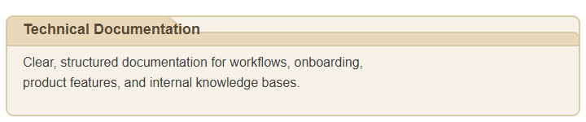
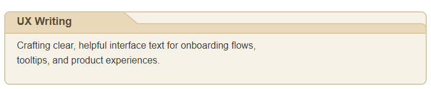
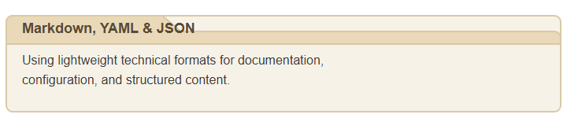

# 🌿Hey Cyn Writes

### Content + Workflow Strategist

### 👋🏽 *Hi, I'm Cyn.* 

I'm writer and assistant who specializes in creating clear documentation, organized workflows, and practical content for technical teams.

I work with developers, indie hackers, and small product teams to make their repositories easier to use, with straightforward docs, onboarding guides, microcopy, and simple content systems. 

If your project could benefit from better documentation or a more organized content structure, [let's connect](https://www.heycywnrites.com/contact).

---

## Skills & Experience

---

### 🛠️ Tools & Platforms

    
    
    
    
    
    

---

### 😍 A Few Things I Love
Traveling, reading, drawing things, cozy creative spaces, and helping people feel less overwhelmed by the digital parts of their business.

### 👉🏽 Get in touch!
Feel free to reach out here or via my [contact page](https://www.heycywnrites.com/contact).